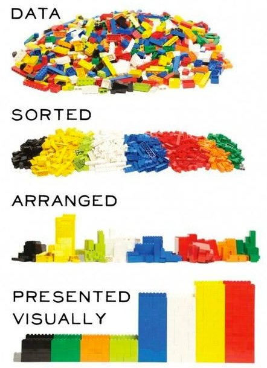
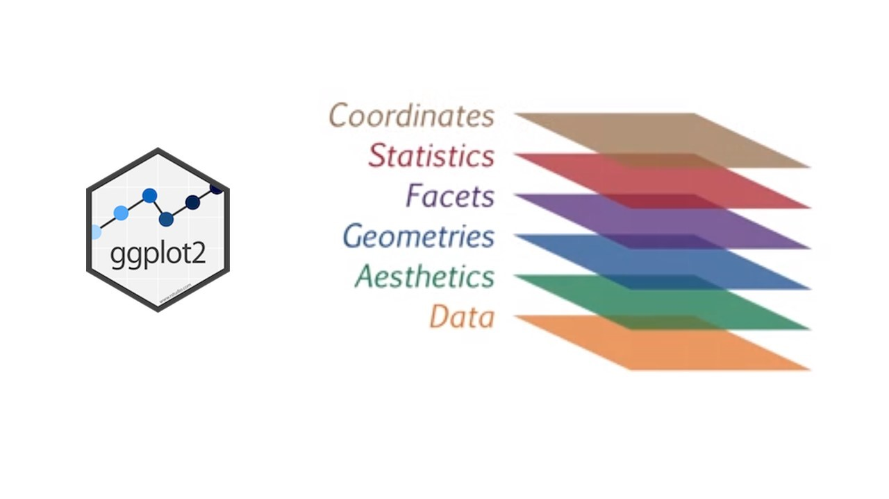
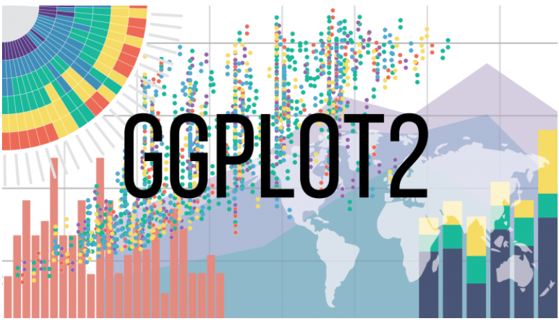

# R ve R Studio


**Wikipedia**

R, istatistiksel hesaplama ve grafikler için yazılım ortamı olup aynı zamanda programlama dilidir. R Foundation tarafından desteklenen ve GNU Tasarısının parçası olan bir özgür yazılımdır. Yeni Zelanda Auckland Üniversitesinden Ross Ihaka ve Robert Gentleman tarafından ortaya çıkarılan R, hâlihazırda R Geliştirme Çekirdek Ekibi tarafından geliştirilmektedir. S programlama diline benzeyen R, S'nin uyarlaması olarak değerlendirilebilir.

İstatistikî yazılım geliştirme için istatistikçiler arasında de fakto standart haline gelen R, istatistikî yazılım geliştirme ve veri analizi alanında kullanılmaktadır.

R'nin kaynak kodları GNU Genel Kamu Lisansı altında olup değişik işletim sistemlerinde kullanılabilir durumdadır. R, komut satırı arayüzü kullanıyor olsa da değişik grafik kullanıcı arayüzleri de bulunmaktadır.

- İlk çıkışı: 1993
- Geliştirici: R Development Core Team
- Kararlı sürüm: 3.6.2 (12 Aralık 2019 (4 ay önce))
- Tasarlayan: Ross Ihaka, Robert Gentleman


**R**

https://www.r-project.org/

**R Windows için**

https://cran.r-project.org/bin/windows/base/

**R Mac için**

https://cran.r-project.org/bin/macosx/

**RStudio**

https://rstudio.com/products/rstudio/download/


# R Programlama Dilini Nasıl Öğrenirim

**Datacamp**

https://www.datacamp.com/

**Udemy**

https://www.udemy.com/course/r-programlama/

https://www.udemy.com/course/veri-bilimi-ve-makine-ogrenmesi-egitimi/


# ggplot2 Kütüphanesi ve Veri Bilimi'nin Kıvanç Tatlıtuğ'u: Hadley Wickham


```{r, out.width="5000px"} 
knitr::include_graphics("www/gorsel3.jpg") 
```

**Grammer of Graphics Makelesi**

https://vita.had.co.nz/papers/layered-grammar.pdf

**R for Data Science Kitabı**

https://r4ds.had.co.nz

**Veri Bilimi Okulu: Veri Görselleştirme Yazısı**

https://www.veribilimiokulu.com/r-ile-veri-gorsellestirme/

**ggplot2 Referans Kağıdı**

https://rstudio.com/wp-content/uploads/2015/03/ggplot2-cheatsheet.pdf


# Veri Bilimi Süreci


```{r, out.width="5000px"} 
knitr::include_graphics("www/datascience.png") 
```


# Veri Görselleştirmeye Giriş 

```{r, out.width="500px"} 
 
```


# Veri görselleştirmek için nelere ihtiyacımız var?

```{r, out.width="5000px"} 
knitr::include_graphics("www/gorsel5.jpg") 
```

•	Veri seti – data

•	Verinin estetik özellikleri – aes

•	Grafik çeşidi – geom


**Veri Türleri**

-  Kesikli Veri (Nitel Veri, Kategorik Veri, Nominal Ölçek, Ordinal Ölçek)
-  Sürekli Veri (Nicel Veri, Aralık Ölçek, Oran Ölçek)


**Görselleştirme Türleri**

-  Tek değişkenli
-  İki değişkenli
-  Çok değişkenli


**Hangi Görsel Çeşidi Ne İşe Yarıyor?**
https://datavizcatalogue.com/TR/


**Estetikler**

-  color
-  fill
-  size
-  shape
-  alpha
-  stroke
-  linetype …

**Geometriler**

-  line
-  bar
-  area
-  scatterplot …


**ggplot2 Kütüphanesi içerisindeki örnek veri setleri**

```{r eval=FALSE, include=FALSE}
ggplot2::diamonds
ggplot2::economics
ggplot2::economics_long
ggplot2::faithfuld
ggplot2::luv_colours
ggplot2::midwest
ggplot2::mpg
ggplot2::msleep
ggplot2::presidential
ggplot2::seals
ggplot2::txhousing
```

```{r, out.width="5000px"} 
 
```


**ggplot yapısı**

```{r eval=FALSE, include=TRUE}
ggplot(data, mapping = aes(x,y))+
  geom_
```


### Tek Değişkenli

*Sürekli*

*Kesikli (Kategorik)*


### İki Değişkenli

*Sürekli-Sürekli*

*Sürekli - Kesikli*

### Estestik Özellikler

*Fill*

*Color*

*Size*

*Shape*

### Tema -Theme

### Lejant - Legend

### Koordinat

### Facet

### İsimlendirme (Başlık, x/y eksenlerinin isimlendirilmesi gibi)


# Veri Bilimi Platformu: Kaggle


https://www.kaggle.com/


**Çalışmada kullanılan veri seti: FIFA 19**

https://www.kaggle.com/karangadiya/fifa19


**Uygulama Kodları**

https://www.kaggle.com/ekrembayar/fifa-data-analysis-visualization


# Uygulama

```{r, out.width="5000px"} 
 
```

# 1. Packages
```{r message=FALSE, warning=FALSE}
library(tidyverse) 
library(magrittr)
library(DataExplorer)
library(maps)
library(plotly)
library(DT)
library(tidytext)
library(gridExtra)


options(scipen = 999)
```


# 2. Data

```{r}
# Data Import
df <- read.csv("data.csv", encoding = "UTF-8")[-1]
head(df)
```


## Data Structure

```{r}
dim(df)
```

**DataExplorer**
```{r}
introduce(df)
```

```{r}
plot_intro(df)
```

**Missing Values**
```{r}
plot_missing(df)
```


# 3. Data Manipulation


## Create Leagues & Sampling
```{r}
bundesliga <- c(
  "1. FC Nürnberg", "1. FSV Mainz 05", "Bayer 04 Leverkusen", "FC Bayern München",
  "Borussia Dortmund", "Borussia Mönchengladbach", "Eintracht Frankfurt",
  "FC Augsburg", "FC Schalke 04", "Fortuna Düsseldorf", "Hannover 96",
  "Hertha BSC", "RB Leipzig", "SC Freiburg", "TSG 1899 Hoffenheim",
  "VfB Stuttgart", "VfL Wolfsburg", "SV Werder Bremen"
)

premierLeague <- c(
  "Arsenal", "Bournemouth", "Brighton & Hove Albion", "Burnley",
  "Cardiff City", "Chelsea", "Crystal Palace", "Everton", "Fulham",
  "Huddersfield Town", "Leicester City", "Liverpool", "Manchester City",
  "Manchester United", "Newcastle United", "Southampton", 
  "Tottenham Hotspur", "Watford", "West Ham United", "Wolverhampton Wanderers"
  
)

laliga <- c(
  "Athletic Club de Bilbao", "Atlético Madrid", "CD Leganés",
  "Deportivo Alavés", "FC Barcelona", "Getafe CF", "Girona FC", 
  "Levante UD", "Rayo Vallecano", "RC Celta", "RCD Espanyol", 
  "Real Betis", "Real Madrid", "Real Sociedad", "Real Valladolid CF",
  "SD Eibar", "SD Huesca", "Sevilla FC", "Valencia CF", "Villarreal CF"
)

seriea <- c(
  "Atalanta","Bologna","Cagliari","Chievo Verona","Empoli", "Fiorentina","Frosinone","Genoa",
  "Inter","Juventus","Lazio","Milan","Napoli","Parma","Roma","Sampdoria","Sassuolo","SPAL",
  "Torino","Udinese"
  
)

superlig <- c(
  "Akhisar Belediyespor","Alanyaspor", "Antalyaspor","Medipol Başakşehir FK","BB Erzurumspor","Beşiktaş JK",
  "Bursaspor","Çaykur Rizespor","Fenerbahçe SK", "Galatasaray SK","Göztepe SK","Kasimpaşa SK",
  "Kayserispor","Atiker Konyaspor","MKE Ankaragücü", "Sivasspor","Trabzonspor","Yeni Malatyaspor"
)

ligue1 <- c(
  "Amiens SC", "Angers SCO", "AS Monaco", "AS Saint-Étienne", "Dijon FCO", "En Avant de Guingamp",
  "FC Nantes", "FC Girondins de Bordeaux", "LOSC Lille", "Montpellier HSC", "Nîmes Olympique", 
  "OGC Nice", "Olympique Lyonnais","Olympique de Marseille", "Paris Saint-Germain", 
  "RC Strasbourg Alsace", "Stade Malherbe Caen", "Stade de Reims", "Stade Rennais FC", "Toulouse Football Club"
)

eredivisie <- c(
  "ADO Den Haag","Ajax", "AZ Alkmaar", "De Graafschap","Excelsior","FC Emmen","FC Groningen",
  "FC Utrecht", "Feyenoord","Fortuna Sittard", "Heracles Almelo","NAC Breda",
  "PEC Zwolle", "PSV","SC Heerenveen","Vitesse","VVV-Venlo","Willem II"
)

liganos <- c(
  "Os Belenenses", "Boavista FC", "CD Feirense", "CD Tondela", "CD Aves", "FC Porto",
  "CD Nacional", "GD Chaves", "Clube Sport Marítimo", "Moreirense FC", "Portimonense SC", "Rio Ave FC",
  "Santa Clara", "SC Braga", "SL Benfica", "Sporting CP", "Vitória Guimarães", "Vitória de Setúbal"
)
```


```{r}
# Leagues
df %<>% mutate(League = if_else(Club %in% bundesliga, "Bundesliga",
                                  if_else(Club %in% premierLeague, "Premier League", 
                                          if_else(Club %in% laliga, "La Liga", 
                                                  if_else(Club %in% seriea, "Serie A", 
                                                          if_else(Club %in% superlig, "Süper Lig", 
                                                                  if_else(Club %in% ligue1, "Ligue 1", 
                                                                          if_else(Club %in% eredivisie, "Eredivisie",
                                                                                  if_else(Club %in% liganos, "Liga Nos", NA_character_)))))))),
                 
                 Country = if_else(League == "Bundesliga", "Germany",
                                   if_else(League == "Premier League", "UK",
                                           if_else(League == "La Liga", "Spain", 
                                                   if_else(League == "Serie A", "Italy", 
                                                           if_else(League == "Süper Lig", "Turkey", 
                                                                   if_else(League == "Ligue 1", "France", 
                                                                           if_else(League == "Liga Nos", "Portugal", 
                                                                                   if_else(League == "Eredivisie", "Netherlands", NA_character_))))))))) %>% 
  filter(!is.na(League)) %>% mutate_if(is.factor, as.character())


rm(bundesliga, premierLeague, laliga, seriea, superlig, ligue1, eredivisie, liganos)
```


## String Manipulation

```{r}
# String Manipulation #

# Player Value
df$Values <- str_remove_all(df$Value,"€")
df$Values <- str_replace_all(df$Values,"K", "000")
df$Values <- str_remove_all(df$Values,"M")

df$Values <- as.numeric(df$Values)

# Player Wage
df$Wages <- str_remove_all(df$Wage,"€")
df$Wages <- str_replace_all(df$Wages,"K", "000")

df$Wages <- as.numeric(df$Wages)

df <- df  %>% mutate(Values = if_else(df$Values < 1000 , Values ** 1000000, Values))
```


## Create Position Class

```{r}
defence <- c("CB", "RB", "LB", "LWB", "RWB", "LCB", "RCB")
midfielder <- c("CM", "CDM","CAM","LM","RM", "LAM", "RAM", "LCM", "RCM", "LDM", "RDM")

df %<>% mutate(Class = if_else(Position %in% "GK", "Goal Keeper",
                                 if_else(Position %in% defence, "Defender",
                                         if_else(Position %in% midfielder, "Midfielder", "Forward"))))

rm(defence, midfielder)
```


## Data Transformation

### Height & Weight 

```{r}
# From categorical to numeric
df %<>%
  mutate(Height = round((as.numeric(str_sub(Height, start=1,end = 1))**30.48) + (as.numeric(str_sub(Height, start = 3, end = 5))** 2.54)),
         Weight = round(as.numeric(str_sub(Weight, start = 1, end = 3)) / 2.204623))
```


### Preferred Foot 

```{r}
df %<>% filter(Preferred.Foot %in% c("Left", "Right")) 
df$Preferred.Foot <- as.factor(as.character(df$Preferred.Foot))
```


## Rename Variables

```{r}
df %<>% 
  rename(
    "Heading.Accuracy"= HeadingAccuracy,
    "Short.Passing"= ShortPassing,
    "FK.Accuracy" = FKAccuracy,
    "Long.Passing"= LongPassing,
    "Ball.Control"= BallControl,
    "Sprint.Speed"= SprintSpeed,
    "Shot.Power"= ShotPower,
    "Long.Shots"= LongShots,
    "Standing.Tackle"= StandingTackle,
    "Sliding.Tackle"= SlidingTackle,
    "GK.Diving"= GKDiving,
    "GK.Handling"= GKHandling,
    "GK.Kicking"= GKKicking,
    "GK.Positioning"= GKPositioning,
    "GK.Reflexes"= GKReflexes
  )
```


## Remove Unnecessary Variables

```{r}
df %<>% select(-ID, -Body.Type, -Real.Face, -Joined, -Loaned.From, -Release.Clause, -Photo, -Flag, -Special, -Work.Rate) 
```


# 4. Tidy Data

```{r}
introduce(df)
```


```{r}
plot_intro(df)
```

```{r}
plot_missing(df)
```


# 5. Data Analysis & Visualization


## Liglerin Yaş Ortalamasının Bulunması

```{r}
ggplot(df, aes(Age))+
  geom_histogram()
```

```{r}
summ <- df %>% 
  group_by(League) %>% 
  summarise(age = mean(Age), median = median(Age))

ggplot()+
  geom_histogram(df, mapping = aes(Age, fill = League))+
  geom_vline(summ, mapping = aes(xintercept = age), color = "red", size = 1.5)+
  geom_text(summ, mapping = aes(x = age+3, y = 65, label = round(age,digits = 2)))+
  facet_wrap(League~.)+
  theme_minimal()+
  theme(legend.position = "bottom")+
  labs(y = "Frekans", x = "Yaş", fill = "Lig", title = "Liglerin Yaş Ortalaması", caption = "@EA Sports - FIFA 19")
  
```

```{r}
df %>% 
  filter(Age > 25) %>% 
  group_by(League) %>% 
  count(sort = TRUE)
```


## Liglerin Pazar Değerlerinin Karşılaştırılması

```{r}
df %>% 
  group_by(League) %>% 
  summarise(Total.Value = sum(as.integer(Values), na.rm = TRUE)) %>% 
  ggplot(aes(reorder(League, Total.Value), Total.Value, fill = Total.Value))+
  geom_col(show.legend = FALSE)+
  coord_flip()+
  theme_minimal()+
  labs(x = NULL, y = "Ligin Pazar Değeri")+
  scale_fill_gradient(low = "khaki", high = "seagreen")+
  theme(axis.line.y = element_line(colour = "darkslategray"),
        axis.ticks.x = element_line(colour = "darkslategray"))+
  scale_y_continuous(labels = c("0 €", "2 Milyar €", "4 Milyar €", "6 Milyar €")) 
```


## İnteraktif Dünya Haritası ve Futbolcu Sayısı

```{r}
world_map <- map_data("world")

numofplayers <- world_map %>% 
  mutate(region = as.character(region)) %>% 
  left_join((df %>% mutate(Nationality = as.character(Nationality),
                           Nationality = if_else(Nationality %in% "England", 
                                                 "UK", Nationality)) %>%
               #filter(League == "Bundesliga") %>%
               count(Nationality, name = "Number of Player") %>%
               rename(region = Nationality) %>%
               mutate(region = as.character(region))), by = "region")
    
ggplotly(
  ggplot(numofplayers, aes(long, lat, group = group))+
    geom_polygon(aes(fill = `Number of Player` ), color = "white", show.legend = FALSE)+
    scale_fill_viridis_c(option = "C")+
    theme_void()+
    labs(fill = "Futbolcu Sayısı",
         title = "Hangi ülkeden kaç futbolcu var?"))
```


## İki Futbolcunun Karşılaştırılması

```{r}
# Futbolcuların Seçimi
players <- df %>% 
  filter(Name %in% c("Cristiano Ronaldo", "L. Messi")) %>% 
# Futbolcu ve Takım İsminin Birleştirilmesi
  mutate(Name = paste0(Name, ", ", Club)) %>%
# Futbolcuların becerilerini temsil eden değişkenlerin seçimi
  select(Name,Crossing:Sliding.Tackle) %>% 
# Değişkenlerdeki noktalama işaretlerinin düzenlenmesi  
  rename_all(funs(gsub("[[:punct:]]", " ", .))) %>% 
# Değişken - Gözlem Dönüşümü
  gather(Skill, Exp, Crossing:`Sliding Tackle`, -Name)
players  

# Becerilere göre futbolcuların ayrı ayrı görselleştirilmesi
ggplot(players, aes(Skill, Exp, fill = Name))+
  geom_col(show.legend = FALSE)+
  coord_flip()+
  facet_wrap(Name~.)+
  scale_fill_manual(values = c("black", "navy"))+
  theme_minimal()

# Becerilere göre futbolcuların birlikte görselleştirilmesi
ggplot(players, aes(Skill, Exp, fill = Name))+
  geom_col(position = "fill")+
  coord_flip()+
  scale_fill_manual(values = c("black", "navy"))+
  theme_minimal()+
  geom_hline(yintercept = 0.5, color = "white", size = 1, linetype = 2)+
  theme(legend.position = "top", axis.text.x=element_blank())+
  labs(title = "Futbolcuların Yeteneklerinin Karşılaştırılması", 
       caption = "@EA Sports - FIFA 19",
       fill = NULL,x = NULL, y = NULL)


```


## Mevkilerin Görselleştirilmesi

```{r}
# Futbolcu Seçimi
player <- df %>% filter(Name == "Neymar Jr")%>%  select(Position, LS:RB)
# Pozisyonları Satır Bazına İndirgemek
player <- as.data.frame(t(player)) %>% 
  rownames_to_column("Pos") %>% 
  mutate(V1 = as.numeric(str_sub(V1, end = 2)),
         Pos = as.factor(Pos))

# Mevkilerin Oluşturulması
pos <- data.frame(
  Pos = as.character(c("LB","LCB","CB", "RCB","RB",
                      "LWB", "LDM", "CDM", "RDM", "RWB",
                      "LM", "LCM", "CM", "RCM", "RM",
                      "LAM", "CAM", "RAM",
                      "LW","LF","CF","RF","RW",
                      "LS","ST","RS")), 
  x = c(1:5, 1:5,1:5, 2:4, 1:5,2:4),
  y = c(rep(1,5), rep(1.5,5), rep(2,5), rep(2.5,3), rep(3,5), rep(3.5,3)))

# Mevki koordinatlarının veri seti ile birleştirilmesi
player <- left_join(player, pos, by = 'Pos')

# Gereksiz gözlemin silinmesi
player <- na.omit(player)

# Saha Formatı 
ggplot(player, aes(x, y, fill = if_else(V1 < 50, "orangered", 
                                        if_else(V1 <60, "orange",
                                                if_else(V1 < 70, "goldenrod1", 
                                                        if_else(V1 <80, "palegreen4",
                                                                if_else(V1 < 90, "forestgreen",
                                                                        if_else(V1 == 0,
                                                                                "orangered","darkgreen"))))))
                   ))+
  geom_point(shape = 22, size = 20, color = "white", show.legend = FALSE,position = "identity")+
  theme(panel.background = element_rect(fill = "#224C56"),
        panel.grid.major = element_blank(),
        panel.grid.minor = element_blank(),
        axis.text = element_blank(),
        axis.ticks = element_blank(),
        axis.title = element_blank(),
        title = element_text(color = "#DA291C",face="bold.italic",size = 23) 
        )+
  geom_text(aes(label = Pos), vjust= -0.5, color = "white", size = 4.5, fontface = "bold")+
  geom_text(aes(label = V1), vjust = 1.5, fontface = "bold", color = "white")+
  scale_fill_identity()+
  ylim(0.8, 4)+
  labs(title = "Neymar Jr Mevki Güçleri")
  
```


## Vücut Kitle Endeksi
  
- İdeal Kilonun Altı:	      < 18,49
- İdeal Kilo:	              18.5 - 24,99
- İdeal Kilonun Üzeri:	    25 - 29,99
- İdeal Kilonun Çok Üzeri:  > 30


```{r}
# Vücut Kitle Endeksinin Hesaplanması
bmi <- df %>% 
  filter(Club == "Liverpool") %>%
  mutate(BMI = round(Weight/(Height/100)^2, digits = 4))%>%
  arrange(-BMI)%>%
  select(Name, Age, Position, Class, Height, Weight, BMI)

# İnteraktif Sonuç
datatable(bmi)
  
# İlk ve son 5'şer gözlemler
bmi2  <- rbind(
  bmi %>% head(5) %>% mutate(BMI = BMI ** -1),
  bmi %>% tail(5)
  ) %>% mutate(Type = if_else(BMI < 0, "Head", "Tail"))

# Futbolcuların Vücut Kitle Endekslerinin Görselleştirilmesi  
bmi2 %>% 
  ggplot(aes(fct_reorder(paste(Name,",", Position), desc(BMI)), BMI))+
  geom_col(aes(fill = Type))+
  geom_text(aes(y = c(rep(-2,5), rep(2,5)),label = round(abs(BMI),digits = 2)), 
            color = "white", fontface = "bold", size = 4)+
  coord_flip()+
  theme_minimal()+
  theme(axis.text.x = element_blank(),
        legend.position = "top",
        panel.background = element_rect(fill = "lightgray"),
        panel.grid.minor = element_blank(),
        axis.text = element_text(color = "slategray", face = "bold.italic",size = 12),
        title = element_text(color = "slategray", face = "bold.italic",size = 20),
        legend.box.background = element_rect(linetype = 2))+
  labs(x = NULL, y = NULL, fill = NULL, title = "BMI Index")+
  scale_fill_manual(values = c("steelblue", "khaki"))
```


## Korelasyon

```{r}
kor <- df %>% 
  filter(League == "La Liga", Class == "Forward") %>% 
  select(Name, Preferred.Foot, Finishing, Shot.Power)
```

```{r}
shapiro.test(kor$Finishing); shapiro.test(kor$Shot.Power)
```

```{r}
cor.test(kor$Shot.Power, kor$Finishing, method = "pearson")
cor.test(kor$Shot.Power, kor$Finishing, method = "kendall")
hypo <- cor.test(kor$Shot.Power, kor$Finishing, method = "spearman")
hypo
```


```{r}
ggplot(kor, aes(Shot.Power, Finishing, label = Name, color = Preferred.Foot))+
  geom_text()+
  theme_minimal()+
  theme(legend.position = "bottom")+
  geom_jitter(alpha = 0.3, size = 2.5, width = 0.3, height = 0.3)+
  geom_smooth(method = "lm", color = "gray40", lty = 2, se = FALSE, size = 0.6)+
  scale_color_manual(values = c("orangered","steelblue"))+
  labs(title = paste("Spearman Correlation Coefficient:", round(hypo$estimate, digits = 2)),
       subtitle = "p-value < 0.05")
```


## Ayak Tercihine Göre Bitiricilik veya Şut Gücü yetenekleri arasında anlamlı bir fark olup olmadığı

```{r}
xt1 <- kor %>% filter(Preferred.Foot == "Left") %>% select(Shot.Power) %>% pull()
xt2 <- kor %>% filter(Preferred.Foot == "Right") %>% select(Shot.Power) %>% pull()
yt1 <- kor %>% filter(Preferred.Foot == "Left") %>% select(Finishing) %>% pull()
yt2 <- kor %>% filter(Preferred.Foot == "Right") %>% select(Finishing) %>% pull()
xht <- wilcox.test(xt1, xt2, alternative = "two.sided")
yht <- wilcox.test(yt1, yt2, alternative = "two.sided")

xht; yht
```

```{r}
grid.arrange(ncol = 2,
  ggplot(kor, aes(x = Preferred.Foot, y = Shot.Power, fill = Preferred.Foot))+
    geom_boxplot(show.legend = FALSE)+
    theme_minimal()+
    scale_fill_manual(values = c("orangered", "steelblue"))+
    ylim(30,100)+
    labs(title = "Şut Gücü"),
  
  ggplot(kor, aes(x = Preferred.Foot, y = Finishing, fill = Preferred.Foot))+
    geom_boxplot(show.legend = FALSE)+
    theme_minimal()+
    scale_fill_manual(values = c("orangered", "steelblue"))+
    ylim(30,100)+
    labs(title = "Bitiricilik")
)


```


## 3 Boyutlu İnteraktif Saçılım Grafiği

```{r}
p3d <- df %>% filter(League == "Süper Lig")  
  
plot_ly(p3d, x = ~Finishing, y = ~Age, z = ~Shot.Power, color = ~Class, text = ~Name) %>% 
  add_markers() %>%
  layout(
    scene = list(xaxis = list(title = 'Bitiricilik'),
                 yaxis = list(title = 'Yaş'),
                 zaxis = list(title = 'Şut Gücü'))
    )
```


## Potansiyelleirn ve Overall karşılaştırılması

```{r}
df %>% 
  filter(Club == "Paris Saint-Germain") %>% 
  select(Name, Overall, Potential) %>% 
  arrange(-Overall) %>% 
  head(10) %>% 
  gather(variable, Exp, -Name) %>% 
  ggplot(aes(Name, Exp, fill = variable))+
  geom_col(position = "dodge")+
  geom_text(aes(label = Exp),position = position_dodge(width = 0.9), vjust = -0.5)+
  scale_fill_manual(values = c("#DA291C", "#004170"))+
  theme_minimal()+
  theme(legend.position = "bottom")+
  labs(fill = NULL, x = NULL, title = "Paris Saint-Germain")
```


## Sözleşmeler Ne Zaman Sonlanacak?

```{r}
df <- df %>% 
  mutate(Contract.Valid.Until = as.numeric(
    str_sub(
      Contract.Valid.Until, str_length(Contract.Valid.Until)-3, str_length(Contract.Valid.Until))
    )
  ) 

df %>% 
  group_by(Contract.Valid.Until, League) %>% 
  count() %>%
  ungroup() %>% 
  ggplot(aes(Contract.Valid.Until, n, color = League))+
  geom_line(size = 1.2)+
  theme_light()+
  scale_color_manual(values = c("seagreen", "royalblue", "orchid", "orange", "gray", "tomato", "navy", "red"))

df %>% 
  group_by(Contract.Valid.Until, League) %>% 
  count() %>%
  ungroup() %>% 
  ggplot(aes(Contract.Valid.Until, n, color = League))+
  geom_line(size = 1.2)+
  theme_light()+
  scale_color_manual(values = c("seagreen", "royalblue", "orchid", "orange", "gray", "tomato", "navy", "red"))+
  facet_wrap(League~.)

```


## En Güçlü Takımlar

```{r}
en.guclu <- df %>% 
  group_by(Club) %>% 
  summarise(mean = mean(Overall)) %>% 
  arrange(-mean) %>% 
  head(20)


df %>% 
  group_by(Club, Class) %>% 
  summarise(mean = mean(Overall)) %>% 
  ungroup() %>% 
  filter(Club %in% en.guclu$Club) %>% 
  ggplot(aes(reorder(Club, mean), mean, fill = Class))+
  geom_col(position = "fill")+
  geom_text(aes(label = round(mean,digits = 2)), position = position_fill(0.5))+
  coord_flip()+
  theme_minimal()+
  theme(legend.position = "top")+
  labs(x = NULL, y = NULL, title = "Pozisyonlara Göre Takım Gücü")
```


## En iyi forvet oyuncularının en iyi özellikleri

```{r}
df %>% 
  arrange(-Overall) %>% 
  filter(Class == "Forward") %>% 
  head(12) %>% 
  select(Name, Crossing:Sliding.Tackle) %>% 
  gather(variables, Exp, -Name) %>% 
  group_by(Name) %>%
  arrange(-Exp) %>% 
  do(head(., 5)) %>% 
  ungroup() %>% 
  mutate(variables = reorder_within(variables, Exp, Name)) %>% 
  ggplot(aes(variables, Exp, fill = Name))+
  geom_col(show.legend = FALSE)+
  geom_text(aes(label = Exp), position = position_stack(vjust = 0.5), color = "gold")+
  facet_wrap(Name~., scales = "free_y")+
  scale_x_reordered()+
  coord_flip()+
  theme_dark()+
  scale_fill_manual(values = c("black", "#004170","royalblue", "white", "white","#12A0D7","#800000", "#800000",
                               "#004170", "black","red", "#6CADDF"))+
  labs(x = NULL, y = NULL)
```


## Ligler içerisindeki pozisyon sınıflarının dağılımı

```{r}
 df %>% group_by(League) %>% count(Class) %>% 
  ggplot(aes(League, n, fill = Class)) +
  geom_col()+
  coord_polar()+
  scale_fill_ordinal()+
  theme_minimal()+
  labs(x = NULL, y = NULL)
```


## Pozisyon sınıfına göre Premier Ligindeki futbolcuarın ortalama özet istatistikleri

```{r}
df %>% 
  filter(League == "Premier League") %>% 
  select(Class, Sprint.Speed, Dribbling, Shot.Power, Finishing, Balance, Short.Passing) %>% 
  group_by(Class) %>% 
  summarise_at(vars(Sprint.Speed:Short.Passing), funs(mean)) %>% 
  gather(variables, values, -Class) %>% 
  ggplot(aes(variables, values, fill = Class))+
  geom_col(position = "dodge")+
  coord_polar()+
  scale_fill_ordinal()+
  theme_minimal()+
  labs(x = NULL, y = NULL)
```


## Yaşlara göre liglerin ortalama potansiyel ve güçlerin karşılaştırılması

```{r}
df %>% 
  group_by(League, Age) %>% 
  summarise(Overall = mean(Overall),
            Potential = mean(Potential)) %>% 
  ggplot()+
  geom_line(aes(Age, Potential, color = "Potential")) +
  geom_line(aes(Age, Overall, color = "Overall"), alpha = 0.5) +
  facet_wrap(League~.)+
  scale_color_manual(values = c("blue", "red"))+
  theme(legend.position = "bottom")+
  labs(color = NULL)
```


# Shiny Kütüphanesi ile FIFA 19 Dashboard


https://ekrem-bayar.shinyapps.io/FifaDash/

```{r, out.width="5000px"} 
knitr::include_graphics("www/gorsel3.png") 
```


